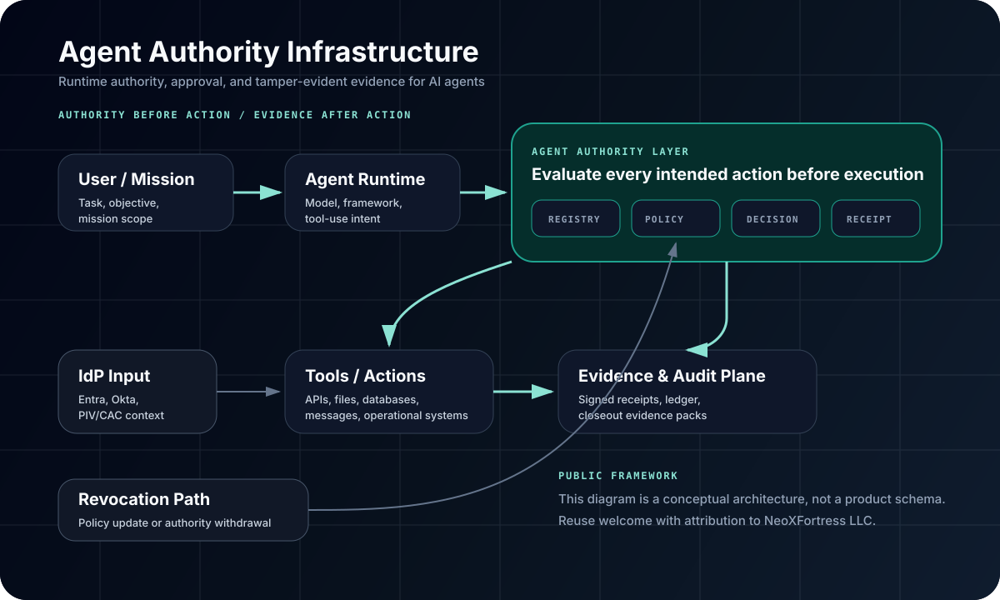

# Agent Authority Infrastructure

[](https://doi.org/10.5281/zenodo.20237100)

**Authority before action. Proof after action.**

Agent Authority Infrastructure (AAI) is a framework for governing AI-agent actions in high-trust environments. It defines what an AI agent is allowed to do before execution, enforces allow / deny / human-review decisions at runtime, and preserves tamper-evident evidence after each action.

This repository is the public framework home for Agent Authority Infrastructure. It is not a product repository and does not contain NeoXFortress Gateway implementation internals, policy DSL schemas, receipt schemas, signing code, or ledger code.

## Why This Exists

AI-agent pilots are not blocked only because models fail. They are blocked because security, compliance, mission, and operational reviewers cannot clearly answer:

- Who authorized the agent?
- What was it allowed to do?
- What was denied or escalated?
- Who approved sensitive actions?
- What evidence exists afterward?

Agent frameworks often record what happened. They do not always record what was authorized.

AAI describes the missing action boundary between agent intent and tool execution.

## Canonical Definition

Agent Authority Infrastructure is the runtime authority, approval, and tamper-evident evidence layer for AI agents.

AAI sits underneath agent frameworks, beside model evaluation and red-teaming, and upstream of SIEM, GRC, RMF, and audit systems. It is not a guardrail, not a model risk platform, not a SIEM, not an identity provider, and not an agent framework. It is the authority and evidence substrate for governed AI-agent action.

## The Three Primitives

| Primitive | Meaning |
| --- | --- |
| Authority | The explicit definition of what an AI agent is allowed to do by mission, tool, data boundary, condition, and time. |
| Approval | The runtime decision that resolves each intended action as allow, deny, or human review before execution. |
| Evidence | The signed, tamper-evident record of attempted, allowed, denied, escalated, and approved actions. |

The model generates a recommendation. The authority layer decides whether the action is allowed to execute.

## Reference Architecture

The public reference architecture uses five layers:

1. User / Mission
2. Agent Runtime
3. Agent Authority Layer
4. Tools / Actions
5. Evidence & Audit Plane



The architecture is designed for critique and reuse with attribution.

Canonical website: https://neoxfortress.com/agent-authority-infrastructure  
Manifesto: https://neoxfortress.com/manifesto  
Reference architecture: https://neoxfortress.com/reference-architecture

## Repository Map

| Path | Purpose |
| --- | --- |
| `docs/01-definition.md` | Canonical definition and short definition. |
| `docs/02-framework.md` | Authority, approval, and evidence primitives. |
| `docs/03-reference-architecture.md` | Stack placement and architecture walkthrough. |
| `docs/04-use-cases.md` | Federal, integrator, and regulated-market use cases. |
| `docs/05-what-aai-is-not.md` | Negative-space positioning. |
| `docs/06-policy-context.md` | OMB, NIST, RMF/ATO, and federal AI context. |
| `docs/07-glossary.md` | Category language and definitions. |
| `docs/08-faq.md` | FAQ for search, AI tools, and practitioners. |
| `architecture/` | Public architecture diagrams and component notes. |
| `crosswalks/` | Initial mappings from policy/control language to AAI evidence concepts. |
| `examples/` | Illustrative examples only; no product schemas. |
| `papers/` | The manifesto and framework paper source. |

## What This Repository Does Not Publish

To keep the public framework useful without exposing product internals, this repository intentionally does not include:

- NeoXFortress Gateway source code
- Policy DSL grammar or parser implementation
- Canonical receipt schema
- Ledger data model
- Signing key management implementation
- Deployment hardening details
- Customer or pilot-specific artifacts

The public framework explains the category. The product implementation remains private unless released separately.

## Citation

Concept DOI: [10.5281/zenodo.20237100](https://doi.org/10.5281/zenodo.20237100)

Use the concept DOI for general references to the Agent Authority Infrastructure framework. Zenodo also assigns version-specific DOIs for each archived GitHub release.

APA:

> Berroa, J. (2026). *Agent Authority Infrastructure: A Framework for Runtime Authority, Approval, and Evidence in AI Agents* (Version 1.0.4). NeoXFortress LLC. https://doi.org/10.5281/zenodo.20237100

BibTeX:

```bibtex
@misc{berroa2026agentauthorityinfrastructure,
  title = {Agent Authority Infrastructure: A Framework for Runtime Authority, Approval, and Evidence in AI Agents},
  author = {Berroa, Julio},
  year = {2026},
  version = {1.0.4},
  publisher = {NeoXFortress LLC},
  doi = {10.5281/zenodo.20237100},
  url = {https://github.com/NeoXFortress/agent-authority-infrastructure}
}
```

## Licensing

Documentation, diagrams, and framework text are intended for reuse with attribution under Creative Commons Attribution 4.0 International (CC BY 4.0).

Any code examples, if added later, should be licensed under Apache License 2.0.

See `LICENSE.md`.

## Maintainer

Julio Berroa  
Founder, NeoXFortress LLC  
https://neoxfortress.com

NeoXFortress is an independent venture. This framework is published by NeoXFortress LLC.
